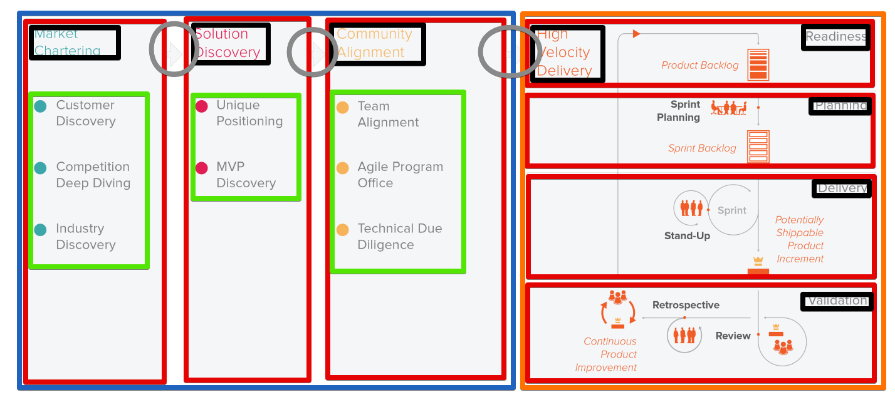
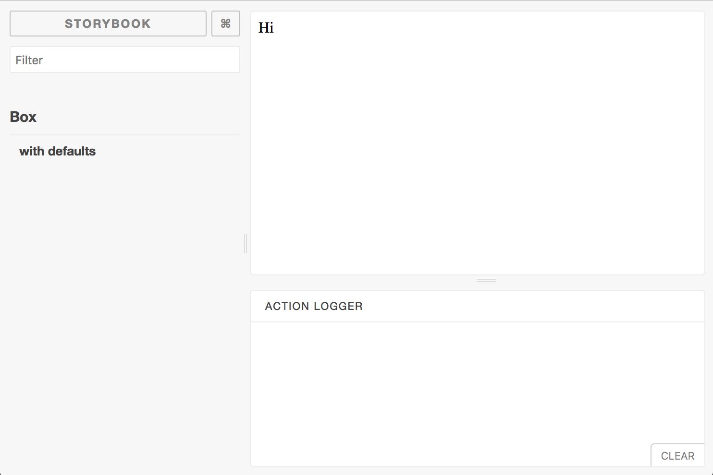
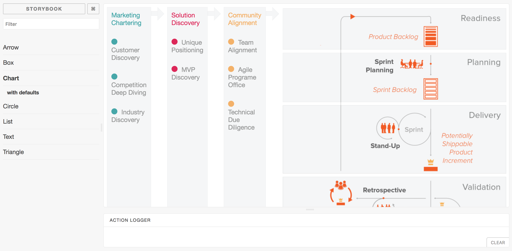

# Starting a React App with React Storybook

> TL;DR; [React Storybook](https://github.com/storybooks/storybook) is a tool that allows you to develop and showcase your React components. This Tutorial walks through creating some components and using [React Storybook](https://github.com/storybooks/storybook).

How do you start a React App? Let's use an analogy! How would you build a house? No you don't need any structural engineering experience to answer the question. Every house needs a good foundation! You can't start with the roof. You have to lay the ground work. The same is true for a React App. In our case any React App is built with components. Let's assume you already possess the designs for your app. We can start by going though all the design(s) and grouping components together.

Here's our example UI:


There are many ways to divide this up to think about how we'd make these components. Here's one way:



Here's a legend of all of them where the new component name will be listed as `<Component/>` then the color of the box or circle.

* `<Columns/>` (Blue)
* `<Rows/>` (Orange)
* `<Box/>` (Red)
* `<Arrow/>` (Gray)
* `<List/>` (Green)
* `<Title/>` (Black)

Now that we have an idea of what components we need we can get an idea for each of the prop types that these components will need.

> Mac Pro Tip: Cmd-Space to Show spotlight Search and type "color" and select the "Digital Color Meter", when the app loads you should see a zoomed in area where your cursor resides. Use Shift+Cmd+c to copy the hex color code of the screen.

The colors we're gonna be needing are as follows, keep these handy we're gonna need them later:

* Blue: #47A7A9
* Red: #DC2859
* Yellow: #F3B169
* Orange: #ED6A48
* Gray: #989999

Now we've got everything we need to start building these components. Let's set up our project and [React Storybook](https://github.com/storybooks/storybook).

## Setup

Let's create a new project from scratch, this project assumes you have `node`, and `npm` installed.

First we can install and setup our repo with `npm` and `storybook`.

```bash
mkdir flow-chart
cd flow-chart
npm init -y
npm install @storybook/react react react-dom prop-types --save
mkdir storybook
touch ./storybook/config.js
```

Let's create all the files we need for the components. The format we're gonna have is each `<Component/>` is going to have it's own folder with `./src/components` within the folder each component will have an `index.js` file and a `stories.js` file.

```bash
mkdir ./src
mkdir ./src/components
mkdir ./src/components/Columns
touch ./src/components/Columns/index.js
touch ./src/components/Columns/stories.js
mkdir ./src/components/Rows
touch ./src/components/Rows/index.js
touch ./src/components/Rows/stories.js
mkdir ./src/components/Box
touch ./src/components/Box/index.js
touch ./src/components/Box/stories.js
mkdir ./src/components/Arrow
touch ./src/components/Arrow/index.js
touch ./src/components/Arrow/stories.js
mkdir ./src/components/List
touch ./src/components/List/index.js
touch ./src/components/List/stories.js
mkdir ./src/components/Title
touch ./src/components/Title/index.js
touch ./src/components/Title/stories.js
```

Open up the `./storybook/config.js` file and add this:

```js
import { configure } from '@storybook/react'

const req = require.context('../src/components', true, /stories\.js$/)

function loadStories() {
  req.keys().forEach((filename) => req(filename))
}

configure(loadStories, module)
```

We can use the following command to start the Storybook server on port `9001`.

```bash
./node_modules/.bin/start-storybook -p 9001 -c ./storybook/
```

> Bash Pro Tip: use the `open` command to open a url in the browser for instance `open http://localhost:9001/`

## Let's make a component

Open up `./Box/index.js` and add the following JavaScript a simple example component that uses a plain old `<div/>` tag with the text `Hi` inside.

```js
import React, {Component} from 'react'

export default class Box extends Component {
  render () {
    return (
      <div>Hi</div>
    )
  }
}
```

Then open up `./Box/stories.js` and add this:

```js
import React from 'react'
import { storiesOf } from '@storybook/react'
import Box from './index'

storiesOf('Box', module)
  .add('with defaults', () => (
    <Box/>
  ))
```

How if you checkout the storybook site (http://localhost:9001/) you should see this, on the left is a list of all the `components` with `stories` and on the right is a empty space for the component to be displayed.



And there we have it! We're connected with React Storybook!

##  Modular CSS with Styled JSX

I've been using [`styled-jsx`](https://github.com/zeit/styled-jsx) to integrate CSS into my modules. Here I'll show you how to add it to the project, first install it with `npm`:

```bash
npm install --save styled-jsx
```

As of right now we don't have a babel config, because storybook is providing a webpack and babel config. In order to use `styled-jsx` we need to add this to our `package.json`

```json
{
  "babel": {
    "plugins": [
      "styled-jsx/babel"
    ]
  }
}
```

### A small primer on Styled JSX

Here's the `<Box>` component from earlier with some `styled-jsx`. You can see here we use a regular `<style/>` tag except we're passing in the `jsx` attribute. Which allows `babel` to pick it up and for `styled-jsx` to work it's magic. Then we use `{}` within the tag which in JSX allows us to "print" a variable. Within that we have a template string and within here we put normal CSS just like you'd be used to already.

```js
import React, {Component} from 'react'
import PropTypes from 'prop-types'

export default class Box extends Component {
  static propTypes = {
    children: PropTypes.node
  }
  render () {
    return (
      <div className='box'>
        {this.props.children}
        <style jsx>{`
          .box {
            background-color: #F5F6F7;
            border: 1px solid #F1F2F3;
            padding: 10px;
          }
        `}</style>
      </div>
    )
  }
}
```

### Results

Here's the final results:


